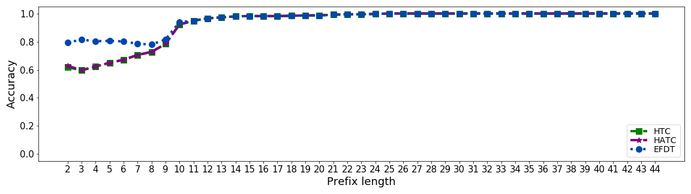
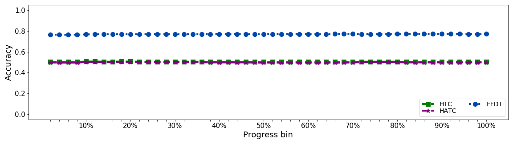
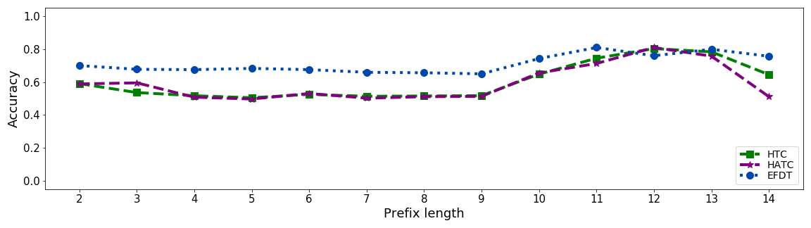
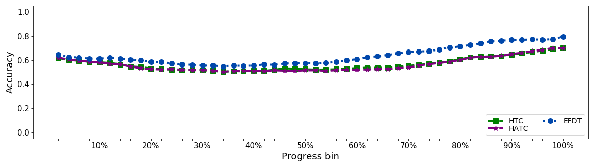
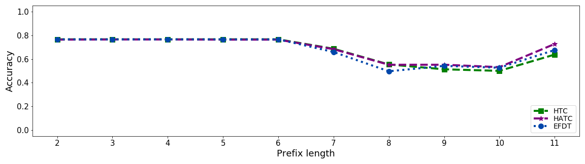
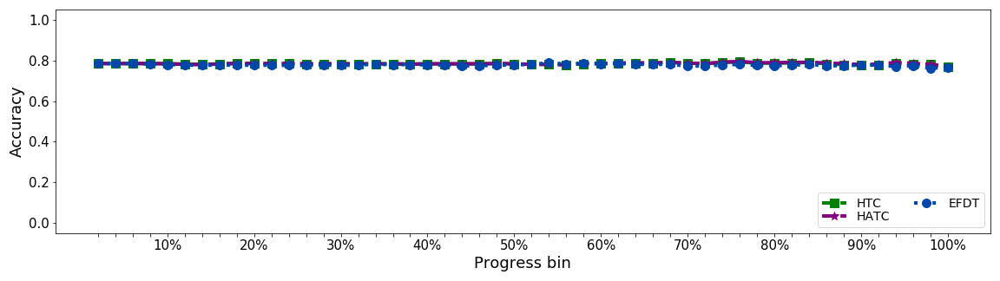
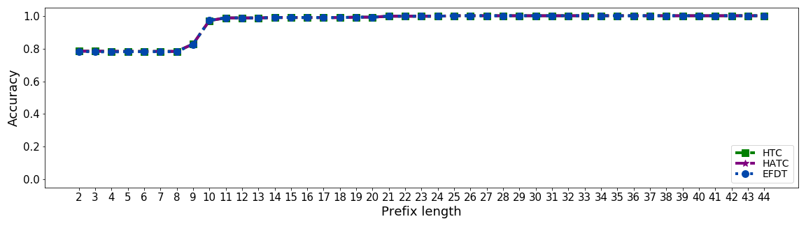
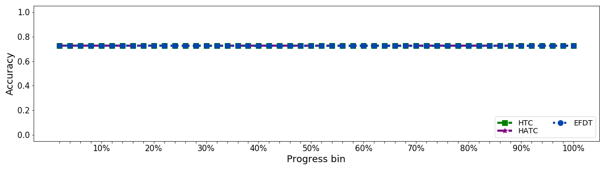

## Experiment results
Following plots (Fig. 3,4,5) are presented in the paper including accuracy by prefix length, case duration, and real-time accuracy for 3 different event logs.

     
     
    <em>3.1)&nbsp Accuracy by prefix length </em>
     
     
    <em>3.2)&nbsp Accuracy by case duration </em>
     
     
    <em>3.3)&nbsp Real-time accuracy </em>    
     
    <em>3)&nbsp BPIC2015_1 experiment results </em>

     
     
    <em>4.1)&nbsp Accuracy by prefix length </em>
     
     
    <em>4.2)&nbsp Accuracy by case duration </em>
     
     
    <em>4.3)&nbsp Real-time accuracy </em>    
     
    <em>4)&nbsp BPIC2017 experiment results </em>

     
     
    <em>5.1)&nbsp Accuracy by prefix length </em>
     
     
    <em>5.2)&nbsp Accuracy by case duration </em>
     
     
    <em>5.3)&nbsp Real-time accuracy </em>    
     
    <em>5)&nbsp IRO5K experiment results </em>

## Additional experiment result
### BPIC 2015 without timestamp issue

     
     
    <em>6.1)&nbsp Accuracy by prefix length </em>
     
     
    <em>6.2)&nbsp Accuracy by case duration </em>
     
     
    <em>6.3)&nbsp Real-time accuracy </em>    
     
    <em>6)&nbsp BPIC2015_1 without timestamp issue experiment results </em>

Figure 6 is extra experiment results of BPIC 2015_1 without timestamp redundancy issue which is omitted in the paper for space reasons.

---

### Real-time evaluation window label distribution

     
     
    <em>7.1)&nbsp BPIC 2015_1</em>
     
     
    <em>7.2)&nbsp BPIC 2017</em>
     
     
    <em>7.3)&nbsp IRO5K</em>    
     
    <em>7)&nbsp Real-time evaluation window label distribution</em>

Figure 7 describes composition of True/False label in real-time evaluation window. 
