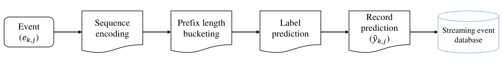
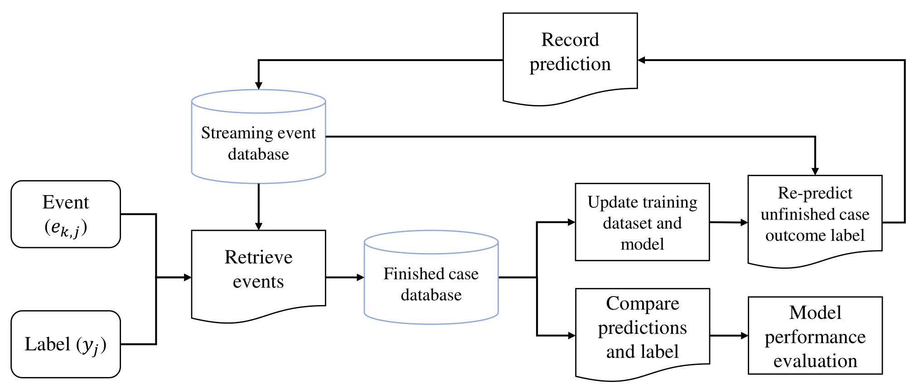
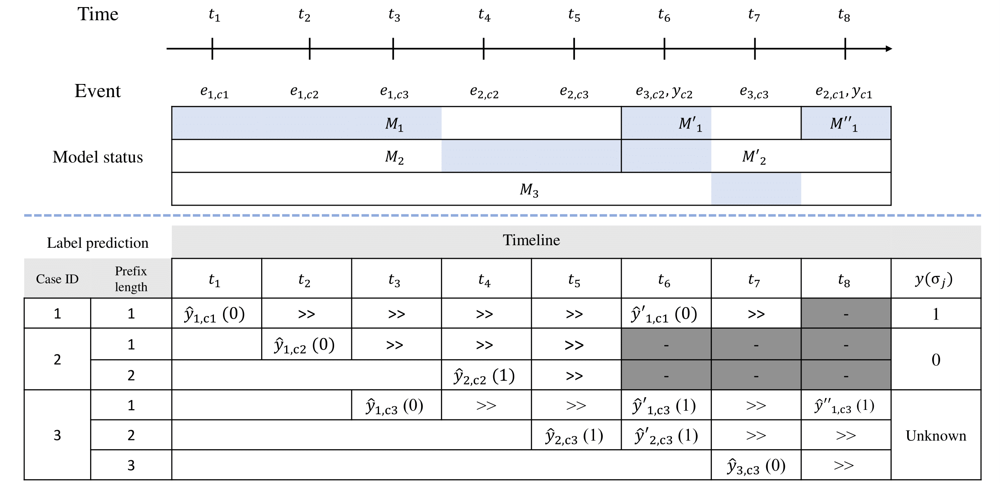

# A framework for online business process outcome predictive monitoring

## General framework
<p align="center">
    
    <br>
    <em>1.a)&nbsp Processing of an event without label</em>
    
    <br>
    <em>1.b)&nbsp Processing of an event with label</em>
</p>

### In this figure, the processing of one event belonging to trace is schematised.
---

First of all, the labels received are only used to train the models in the framework. The event  may either be the last of , i.e., length of , in which case the label  becomes known, or not. When an event is not the last one of its trace (see Fig. 1.a), it is used to generate a new prefix of  for prefix . Then, a prediction  for the new prefix can be computed using the model for prefix . Receiving the last event , and its label (see Fig. 1.b) enables (i) to evaluate all the predictions  that have been generated for all prefixes  (evaluation before training), (ii) to update the models  owing to the availability of new labelled prefixes. Finally, it is possible (iii) to compute a new set of predicted labels , with  and for all the prefixes for which a label has not been yet received (train and retest).  

## Sample scenario and performance indicator
<p align="center">
    <br>
    <br>
    <em>2)&nbsp Evaluation methods: supporting example</em>
</p>

### Fig. 2 exemplifies what stated above in the context of the proposed framework, considering 3 process cases and prefix length up to 3. 
---
Note that different versions of the same model pomk are generated along the considered timeline. In particular, a new version of  is generated when a new label  for a case . For instance, in the example 3 different versions of  are generated. Second, new predictions for prefixes of length  are generated each time a new version of  is available. In the example, receiving the label  of case c1 at t8 triggers (i) the creation
of a new version of  () and (ii) the generation of a new prediction  for case c3, which is still running at t8. Finally, note that a prediction can only be evaluated when the corresponding label becomes available. In the example, the predictions generated for all the prefixes of case 3 cannot be evaluated because the label of case 3 has yet to be received at t8.

## Performance evaluation
### 1) Evaluating performance using a local timeline
#### a) Continuous evaluation by prefix length 
_“How likely is theframework to output a correct prediction for a running trace at prefix length k?”_

The design of a suitable performance measure starts from aggregating the predictions available for a case at a given prefix length, in order to obtain one reference value for each trace for which a label has been received at each prefix length.

#### b) Continuous evaluation by case duration
_"How likely is the framework to output a correct prediction when x% of its duration has elapsed?"_

This type of evaluation is similar to the previous one, however, in this case the progress of a case is identified by the time elapsed since the beginning of it.

### 2) Real-time model performance
_“How likely are the most recentprediction(s) obtained from a model to be eventually correct?”_

 In the real-time method we first define w as the size of a test window containing the traces associated with the latest W labels  that have been received. Then consider the  average of the performance across all the predictions available, at any prefix length, for each trace in this window.

## Experiment results

Experiment results and additional results are presented in following link:  
[Experiment Results](./Experiment_results.md)

---
```
📦streaming_event_prediction4pm
 ┣ 📂data
 ┃ ┣ 📜bpic15.csv
 ┃ ┣ 📜bpic17.csv
 ┃ ┣ 📜iro5k.csv
 ┣ 📂img
 ┃ ┗ 📂readme_img
 ┃ ┃ ┣ 📜Performance_indiciator_figure.png
 ┃ ┃ ┣ 📜general_framework_a.png
 ┃ ┃ ┗ 📜general_framework_b.png
 ┣ ┗ 📂additional_results
 ┣ ┗ 📂bpic15
 ┣ ┗ 📂bpic17
 ┣ ┗ 📂iro5k
 ┣ 📜.gitignore
 ┣ 📜Readme.md
 ┣ 📜dataset_parameters.json
 ┣ 📜encoding.py
 ┣ 📜offline.ipynb
 ┣ 📜streaming_classification.ipynb
 ┗ 📜utils.py
 ```