# Process predictive monitoring with streaming data

## Framework

    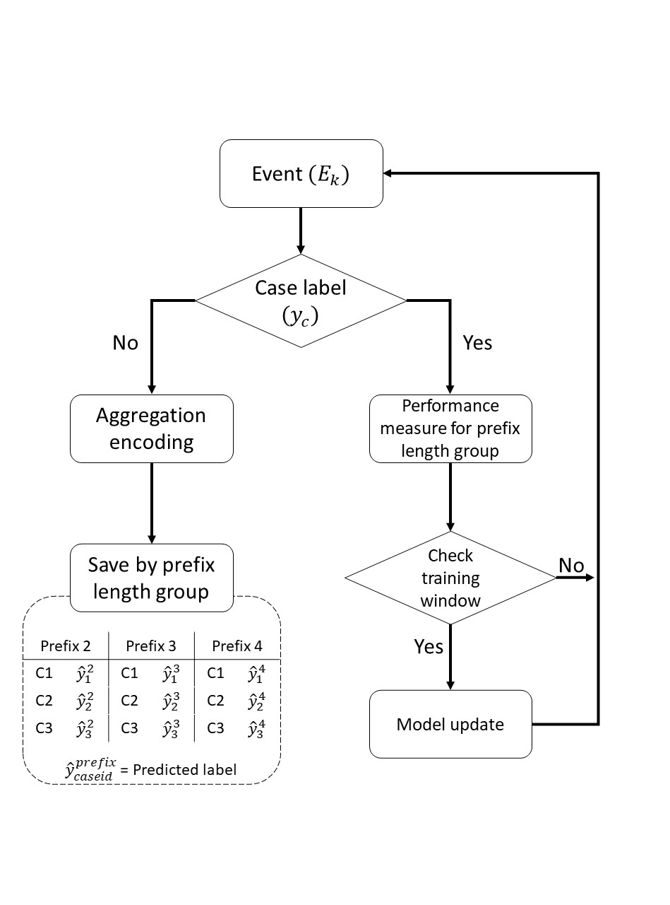

## Dataset
1) _Bank Account Closure_ [1]   
   __Label__: Activity occurance  
   (1) Authorization Requested  
   (2) Pending Request for acquittance of heirs  
   (3) Back-Office Adjustment Requested  

2) _Artificial log_ [2]  
   __Label__: Activity occurance  
   (1) Approve_application

## 1. BAC activity occurance [1]

### Case length with activity occurred

| Occured activity | Number of cases |
|-|-|
| Authorization Requested | 12499 |
| Pending Request for Acquittance of heirs | 2119 |
| BackOffice Adjustment Requested | 3320 |
||
| Total cases | 32429 |  

### Occured activity index/prefix length
__Authorization Requested__
| Prefix | Cases |
|-|-|
| 0 | 5 |
| 1 | 37 |
| 2 | 12457 |
  
__Pending Request for acquittance of heirs__  
| Prefix | Cases |
|-|-|
| 4 | 3 |
| 5 | 8 |
| 6 | 1414 |
| 7 | 12 |
| 8 | 595 |
| 10 | 70 |
| 12 | 13 |
| 14 | 2 |
| 16 | 2 |
  
__Back-Office Adjustment Requested__
| Prefix | Cases |
|-|-|
| 2 | 5 |
| 3 | 53 |
| 4 | 2036 |
| 5 | 114 |
| 6 | 1046 |
| 7 | 18 |
| 8 | 38 |
| 9 | 1 |
| 10 | 8 |
| 11 | 1 |

### 1-2. BAC activity occurance results
_"Authorization Requested"_

    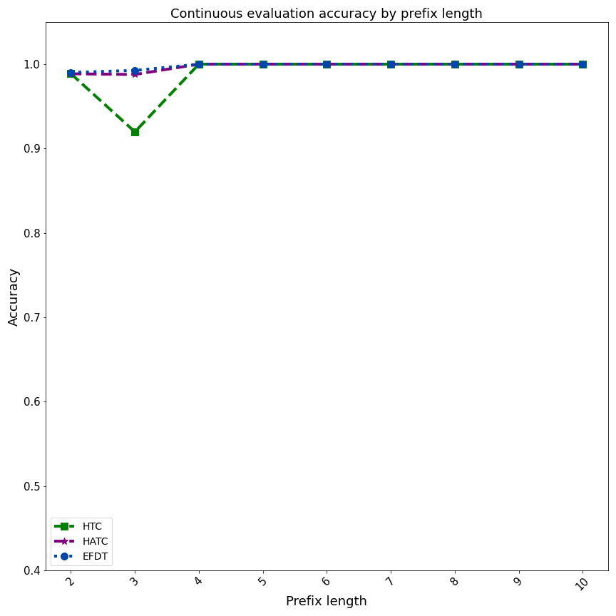

    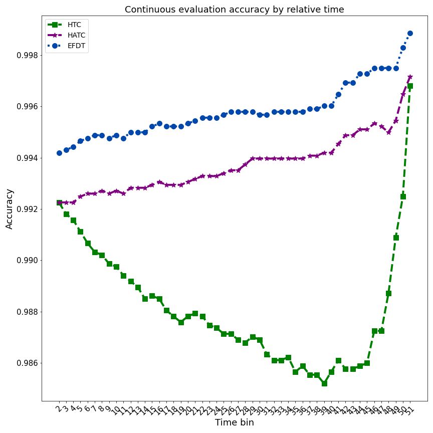

_"Pending Request for acquittance of heirs"_

    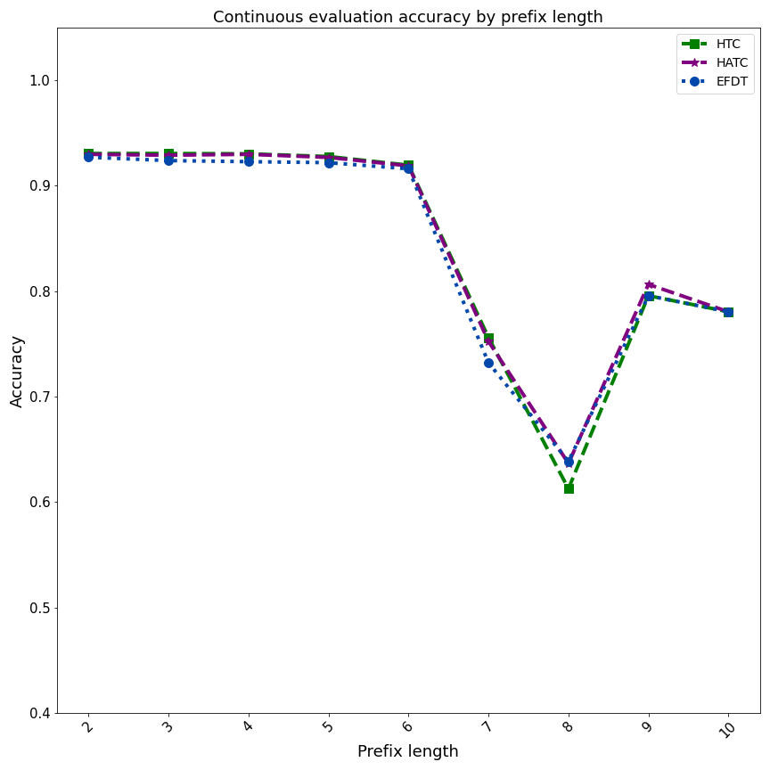

    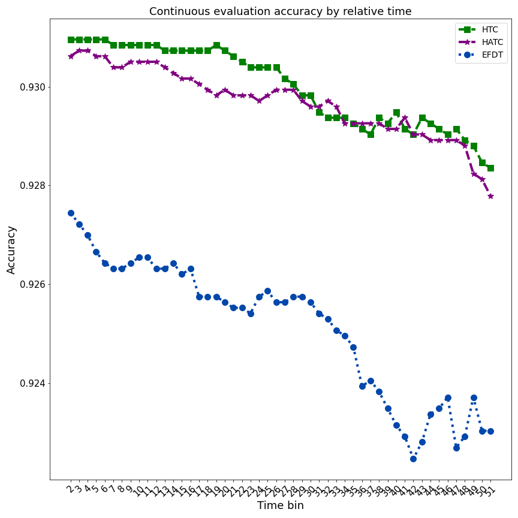

_"Back-Office Adjustment Requested"_

    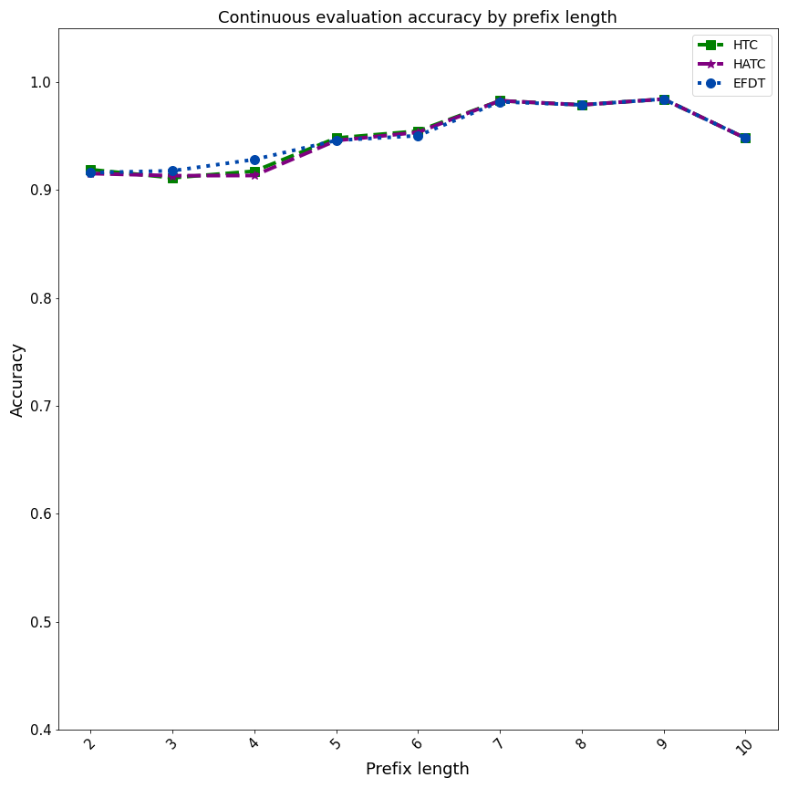

    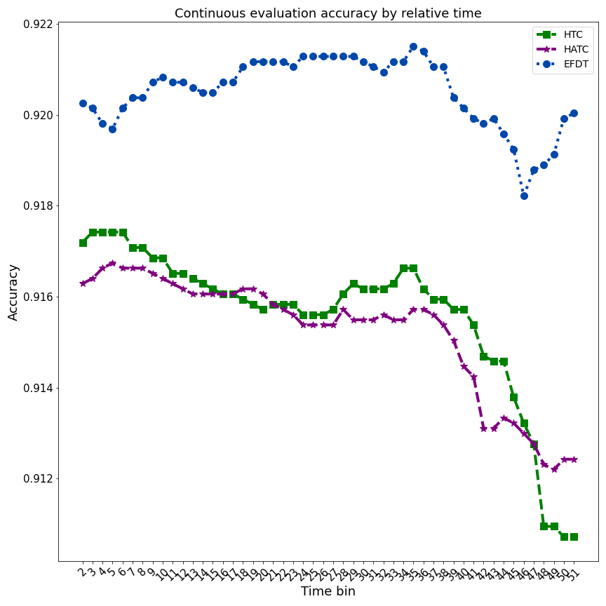

## 2. Artificial log [2]

### Original trace (baseline)

    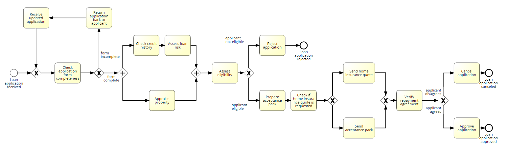

### Process drift trace

    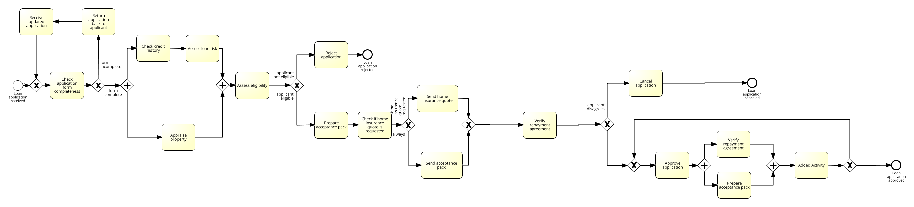

### 2-2. Artificial log activity occurance results

_"Approve_application"_ 

    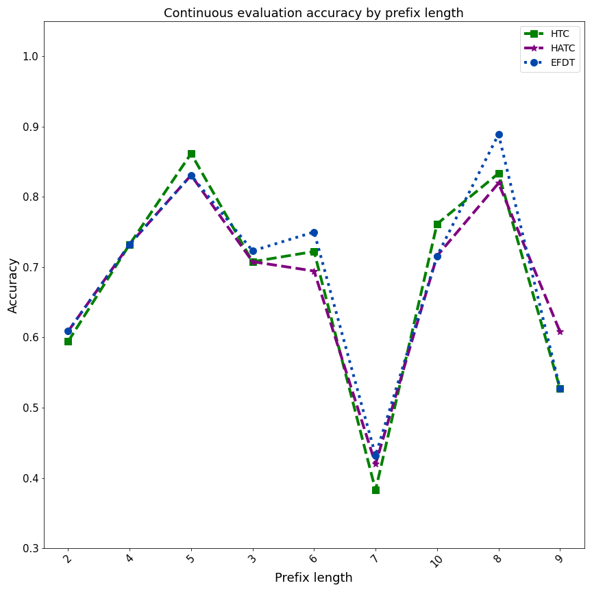

    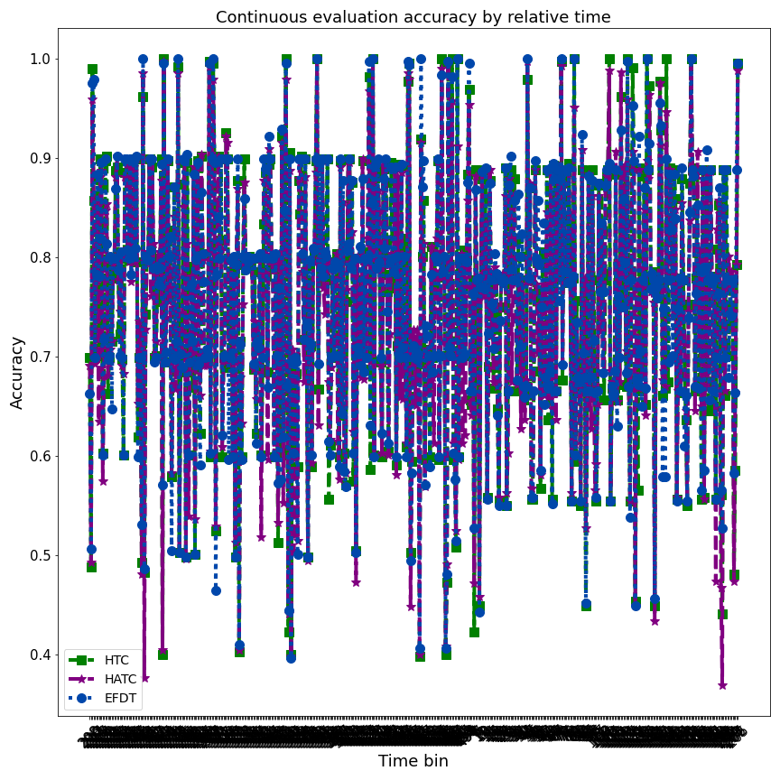

---
[1]Galanti, Riccardo, et al. "Explainable predictive process monitoring." 2020 2nd International Conference on Process Mining (ICPM). IEEE, 2020.

[2]Maaradji, Abderrahmane, et al. "Fast and accurate business process drift detection." International Conference on Business Process Management. Springer, Cham, 2016.