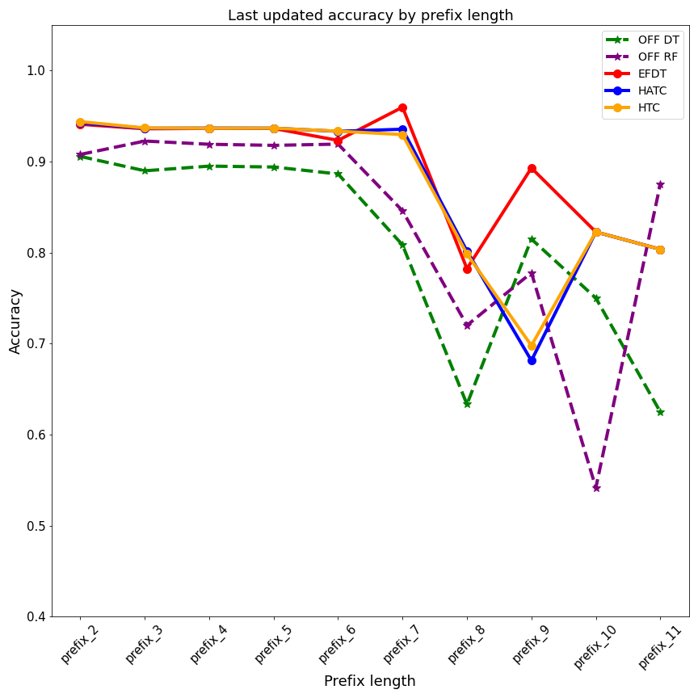

# Process predictive monitoring with streaming data

## Framework

    

BAC activity occurance: 'Pending Request for acquittance of heirs'
Case length with activity occurred

## Continuous evaluation of HTC, HATC, EFDT  by prefix length and bin updates

    

    

    

### Accuracy comparison between last updated streaming and offline prediction

    

